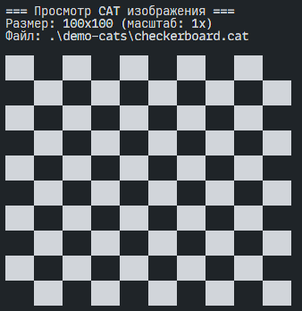

# CAT Image Format

Формат изображений `.cat` с инструментами для конвертации и просмотра.
Превосходит даже PNG по размеру и скорости обработки.



## Сравнения

| Формат | Размер (байты) |
|--------|----------------|
| .CAT   | 212            |
| .PNG   | 527            |
| .WEBP  | 622            |
| .AVIF  | 659            |
| .JPG   | 3169           |

## Особенности

- **Оптимизированное сжатие**: Использует алгоритм deflate с предварительной оптимизацией данных
- **Целостность данных**: Встроенная проверка контрольной суммы
- **Метаданные**: Сохранение информации о времени создания и параметрах изображения
- **ASCII просмотр**: Возможность просмотра изображения прямо в терминале

## Установка

```bash
bun i
bun run build
```

## Использование

### Простой запуск

```cmd
catimg.exe convert -i input.png -o output.cat
catimg.exe view -f image.cat
```

### Кроссплатформенный запуск

```bash
bun dist/index.js convert -i input.png -o output.cat
```

### Основные команды

### Конвертация PNG в CAT

```bash
bun dist/index.js convert -i input.png -o output.cat
```

### Конвертация CAT в PNG

```bash
bun dist/index.js convert -i input.cat -o output.png
```

### Просмотр CAT изображения

```bash
# Обычный просмотр
bun dist/index.js view -f image.cat

# Просмотр с масштабированием
bun dist/index.js view -f image.cat -s 0.5
```

### Информация о CAT файле

```bash
bun dist/index.js info -f image.cat
```

### Массовая конвертация

```bash
# Конвертация всех PNG в директории в CAT
bun dist/index.js batch -i input-dir -o output-dir -f cat

# Конвертация всех CAT в директории в PNG
bun dist/index.js batch -i input-dir -o output-dir -f png
```

### Анализ сжатия

```bash
bun dist/index.js analyze -d directory-with-png-files
```

## Формат файла CAT

### Структура заголовка (32 байта)

| Поле        | Размер  | Описание                 |
| ----------- | ------- | ------------------------ |
| magic       | 4 байта | Сигнатура "CAT1"         |
| version     | 4 байта | Версия формата           |
| width       | 4 байта | Ширина изображения       |
| height      | 4 байта | Высота изображения       |
| compression | 4 байта | Тип сжатия (1 = deflate) |
| timestamp   | 4 байта | Unix timestamp создания  |
| checksum    | 4 байта | Контрольная сумма данных |
| reserved    | 4 байта | Зарезервировано          |
